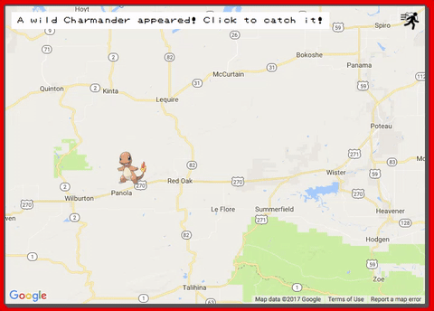
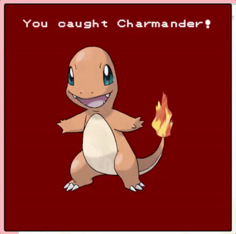

# PokeHunter

[PokeHunter](https://github.com/joycechau) is a web application inspired by the popular Pokemon Go app.  The objective is to explore the world and catch all 150 Pokemon.  

PokeHunter was built by [Joyce Chau](https://github.com/joycechau) and
[Kenneth Truong](https://github.com/kennethtruong).


## Example Features

### Catching Pokemon


### Caught Pokemon


## Architecture and Technologies
The project was implemented with the following technologies:
* React for overall structure and DOM manipulation
* Google Maps API for displaying the world map
* Vanilla Javascript and ```jQuery``` for additional DOM manipulation
* Webpack to bundle and serve up the various scripts

## Technical Implementation

2 days were dedicated to researching and integrating the Google Maps API.  Custom markers, info windows, and additional overlays were added to the map.  

Snippet of adding Pokeball markers to the map:

```
addPokeballMarker(map) {
  const randomPokeball = POKEBALL_MARKERS[Math.floor(Math.random() * POKEBALL_MARKERS.length)];
  const lat = Math.random() * (MAX_LAT - MIN_LAT) + MIN_LAT;
  const lng = Math.random() * (MAX_LNG - MIN_LNG) + MIN_LNG;
  const pokeballMarker = new google.maps.Marker({
    position: { lat, lng },
    icon: randomPokeball,
    map: map
  });

  this.pokeballs.push(pokeballMarker);

  pokeballMarker.addListener('click', () => {
    pokeballMarker.setMap(null);
    this.pokeballs.splice(this.pokeballs.indexOf(pokeballMarker), 1);
    this.addPokeballMarker(map);
    this.pokeballs.forEach((pokeball) => pokeball.setMap(null));

    const markerLat = pokeballMarker.getPosition().lat();
    const markerLng = pokeballMarker.getPosition().lng();

    map.panTo({ lat: markerLat, lng: markerLng });
    map.setZoom(10);
    this.addPokemonMarker(map, markerLat, markerLng);
  });
}
```
